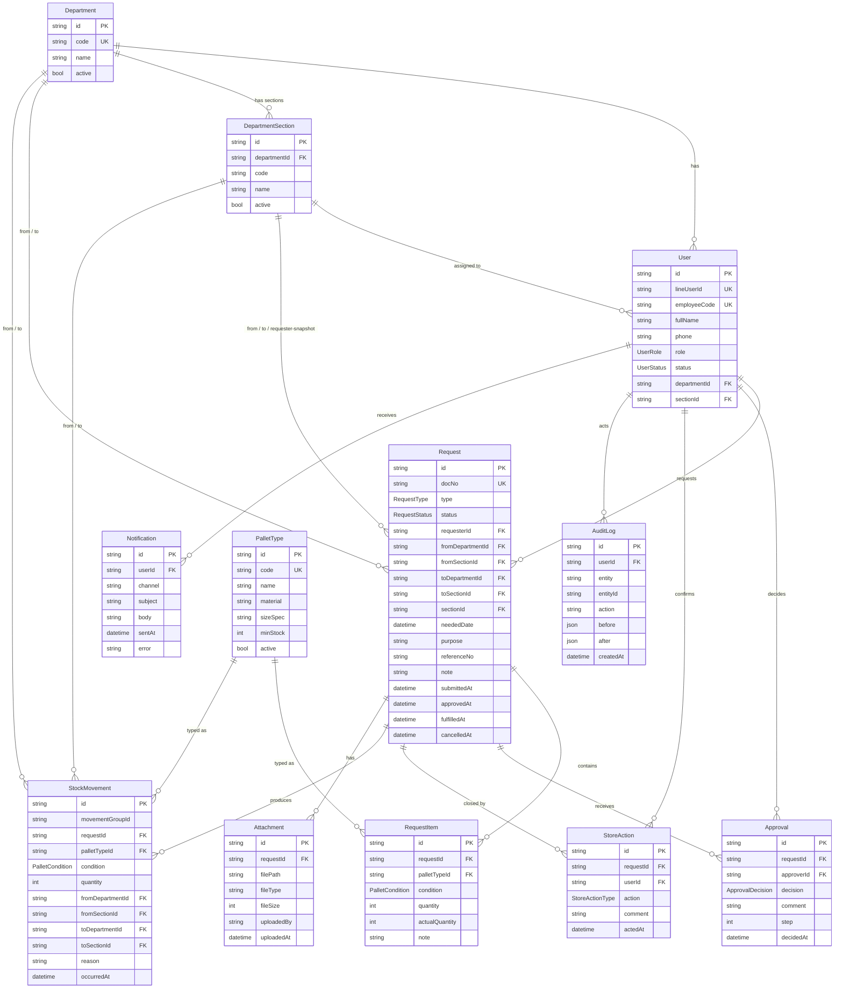

# ER Diagram — ระบบเบิกจ่ายพาเลท

Diagram นี้สะท้อนโครงสร้างที่กำหนดใน `prisma/schema.prisma` โดยตรง (ไม่มีตาราง `locations` แล้ว ตั้งแต่ 2026-10-02)

## ภาพรวม



## Enums

- **`UserRole`** = `REQUESTER` | `APPROVER` | `STORE` | `ADMIN` | `VIEWER`
- **`UserStatus`** = `PENDING` | `ACTIVE` | `DISABLED`
- **`PalletCondition`** = `USABLE` | `IN_REPAIR` | `UNUSABLE`
- **`RequestType`** = `RECEIVE_NEW` | `ISSUE_INTERNAL` | `RETURN_INTERNAL` | `TRANSFER_INTERNAL` | `SHIP_CUSTOMER` | `RETURN_CUSTOMER` | `SEND_REPAIR` | `RECEIVE_REPAIR` | `WRITE_OFF` | `ADJUSTMENT`
  - UI เฟส 1 ใช้แค่ 3 ค่าแรก + 2 ตัวสำหรับ admin (`WRITE_OFF`, `ADJUSTMENT`) · ค่าที่เหลือเก็บไว้สำหรับเฟสถัดไป
- **`RequestStatus`** = `DRAFT` | `PENDING` | `APPROVED` | `FULFILLED` | `REJECTED` | `CANCELLED`
- **`ApprovalDecision`** = `APPROVED` | `REJECTED`
- **`StoreActionType`** = `CONFIRM_DISPATCH` | `CONFIRM_RECEIPT`

## หลักการที่ต้องยึด

1. **`stock_movements` เป็นแหล่งความจริงเดียว**
   ยอดคงเหลือของ `(palletType, condition, department)` = `SUM(in.quantity) − SUM(out.quantity)` เท่านั้น
   ไม่มีตาราง `stock_balances` ให้แก้ไขตรง ๆ

2. **"คลังพาเลท" = Department ที่มี `code = "WH-PL"`**
   ยอดในคลัง = pallets ที่ `toDepartmentId = WH-PL` ลบด้วย `fromDepartmentId = WH-PL`
   ไม่มี Location ชนิด WAREHOUSE อีกต่อไป

3. **"เบิก/คืน" ไม่ถามต้นทาง/ปลายทาง**
   backend อ่าน `user.departmentId` + `user.sectionId` แล้ว routing เอง:
   - `RECEIVE_NEW`: from = null (ไม่มี supplier concept), to = WH-PL
   - `ISSUE_INTERNAL`: from = WH-PL, to = user's dept/section
   - `RETURN_INTERNAL`: from = user's dept/section, to = WH-PL
   `request.sectionId` คือ snapshot ของ `requester.sectionId` ณ เวลาที่สร้าง (ไม่เปลี่ยนถ้า user ย้าย section ภายหลัง)

4. **เปลี่ยนสถานะพาเลทที่คลังเดิม**
   ทำเป็น 2 แถวใน `stock_movements` ที่มี `movementGroupId` เดียวกัน:
   - แถวที่ 1: OUT จาก `(WH-PL, USABLE)`
   - แถวที่ 2: IN ไปที่ `(WH-PL, IN_REPAIR)`
   รักษา invariant "1 แถว = 1 condition"

5. **Soft-reserve**
   คำขอ `ISSUE_INTERNAL` / `WRITE_OFF` สถานะ `PENDING`/`APPROVED` → หัก available ที่คลัง (WH-PL) ก่อนที่ movement จะเกิดจริง
   `RETURN_INTERNAL` ไม่ reserve dept balance เพราะเฟส 1 ไม่ track dept balance

6. **Attachments เก็บใน Supabase Storage**
   ตาราง `attachments` เก็บเฉพาะ path + metadata (fileType / fileSize / uploadedBy) ไม่เก็บ blob

7. **Audit log เขียนจาก service layer เท่านั้น**
   `writeAudit()` ใน `lib/services/audit.ts` เป็นช่องทางเดียว · ห้ามเขียน `audit_logs` ตรง ๆ จาก route handler

8. **Soft-delete ทั้งหมด**
   ตาราง master (pallet_types / departments / department_sections) มีคอลัมน์ `active boolean` ใช้ปิดการใช้งานแทนลบจริง เพื่อรักษา FK ของประวัติ

## Query ตัวอย่าง

**ยอดในคลัง**
```sql
SELECT m.palletTypeId, m.condition,
       SUM(CASE WHEN m."toDepartmentId" = d.id THEN m.quantity ELSE 0 END)
     - SUM(CASE WHEN m."fromDepartmentId" = d.id THEN m.quantity ELSE 0 END) AS on_hand
FROM stock_movements m
JOIN departments d ON d.code = 'WH-PL'
WHERE m."toDepartmentId" = d.id OR m."fromDepartmentId" = d.id
GROUP BY m.palletTypeId, m.condition;
```

**ยอดนอกคลังรวมแยกตามแผนก (ไม่รวม WH-PL)**
```sql
SELECT d.code, d.name,
       SUM(CASE WHEN m."toDepartmentId"   = d.id THEN m.quantity ELSE 0 END)
     - SUM(CASE WHEN m."fromDepartmentId" = d.id THEN m.quantity ELSE 0 END) AS outstanding
FROM stock_movements m
JOIN departments d ON (m."toDepartmentId" = d.id OR m."fromDepartmentId" = d.id)
WHERE d.code <> 'WH-PL'
GROUP BY d.id, d.code, d.name
HAVING SUM(CASE WHEN m."toDepartmentId" = d.id THEN m.quantity ELSE 0 END)
     - SUM(CASE WHEN m."fromDepartmentId" = d.id THEN m.quantity ELSE 0 END) > 0;
```

**คำขอรออนุมัติที่ยัง reserve ยอดคลังอยู่**
```sql
SELECT ri."palletTypeId", ri.condition, SUM(ri.quantity) AS reserved
FROM request_items ri
JOIN requests r ON r.id = ri."requestId"
JOIN departments d ON d.id = r."fromDepartmentId" AND d.code = 'WH-PL'
WHERE r.status IN ('PENDING', 'APPROVED')
  AND r.type IN ('ISSUE_INTERNAL', 'WRITE_OFF')
GROUP BY ri."palletTypeId", ri.condition;
```
